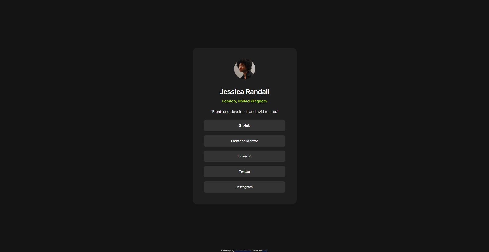

# Frontend Mentor - Social links profile solution

This is a solution to the [Social links profile challenge on Frontend Mentor](https://www.frontendmentor.io/challenges/social-links-profile-UG32l9m6dQ). Frontend Mentor challenges help you improve your coding skills by building realistic projects. 

## Table of contents

  - [Screenshot](#screenshot)
  - [Links](#links)
  - [Built with](#built-with)
  - [Continued development](#continued-development)
  - [Author](#author)

### Screenshot

### Links

- Solution URL: [Click here](https://github.com/kauevecchia/social-links)
- Live Site URL: [Click here](https://kauevecchia.github.io/social-links/)

### Built with

- HTML5
- CSS3
- Flexbox
- Mobile-first workflow
- Media Query

### Continued development

I want to improve my HTML and CSS abilities, such as semantic HTML, flexbox, css grid and media queries.

## Author

- Website - [Kauê](https://github.com/kauevecchia)
- Frontend Mentor - [@kauevecchia](https://www.frontendmentor.io/profile/kauevecchia)
